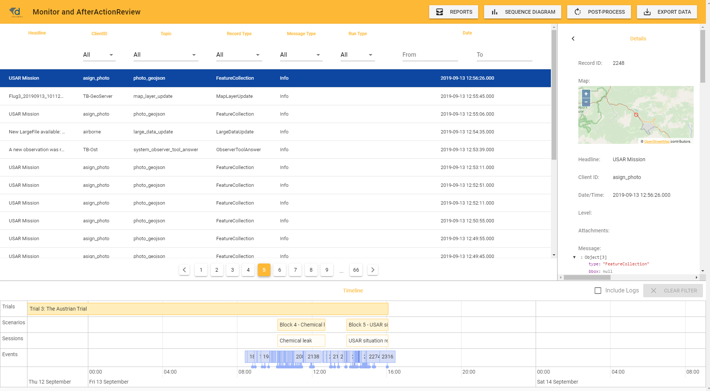
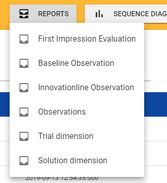

# Monitoring and After-Action Review

The Monitoring and After-Action Review (MaAAR) tool provides the possibility to show and review data that has been collected during and after a trial.
Its main purpose is to facilitate the evaluation of the trialled solutions against the predefined objectives, and to help the participants determine how well they functioned. 
It collects messages (exchanged during trial) and shows them in a list of records. The list entries can be filtered by the user by several criteria. In addition, if an entry is selected, the details of this entry are shown.
Additionally to the List view, all messages are displayed in the Timeline in the bottom of the UI.

## Menu
The menu contains of 4 main menus that split each other into several sub menu items fullfilling different actions on the records.

## Reports
Each menu item is requesting a report with specific informations belonging to the type of report. Mainly Obervations are taken
for generating those reports. Each report is a PDF Document that can be displayed and downloaded from the MaAAR.

* Following Reports can be created (if corresponding data are available).

## Sequence diagram

## Post process

## Export data

## List View

## Timeline

## Details View

### Attachments

