

# Monitoring and After-Action Review

The Monitoring and After-Action Review (MaAAR) tool provides the possibility to show and review data that has been collected during and after a trial.
Its main purpose is to facilitate the evaluation of the trialled solutions against the predefined objectives, and to help the participants determine how well they functioned. 
It collects messages (exchanged during trial) and shows them in a list of records. The list entries can be filtered by the user by several criteria. In addition, if an entry is selected, the details of this entry are shown.
Additionally to the List view, all messages are displayed in the Timeline in the bottom of the UI.

## Menu
The menu contains of 4 main menus that split each other into several sub menu items fullfilling different actions on the records.

## Reports
Each menu item is requesting a report with specific informations belonging to the type of report. Mainly Obervations are taken
for generating those reports. Each report is a PDF Document that can be displayed and downloaded from the MaAAR.

* Following Reports can be created (if corresponding data are available).

## Sequence diagram
The MaAAR is able to display the messages collected during the trial in a chronological order.
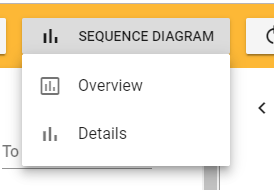

### Overview
During the trail it is always possible to display the last 20 received messages to get a high level overview of the current messages in the trial. The overview diagram is opened in a seperate tab, and will be refreshed automatically as soon as a new message was injected.
  
### Details
The detailed sequence diagram always shows all records from the list view. Filtering on the list view also has an effect on the creation of
the sequence diagrams. Already created diagrams will not be changed if list view filter is changed.
Each sequence diagram is opened in a seperate Tab and can be downloaded as svg to the client.
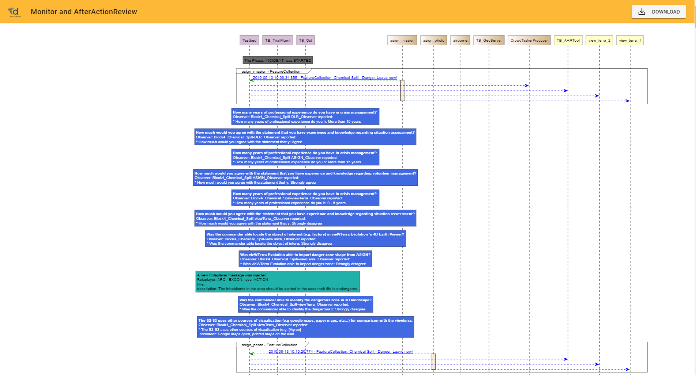

#### Display details of message
Messages send through the testbed presented as a clickable link can display the details in a Popup window (same as details in the main window).
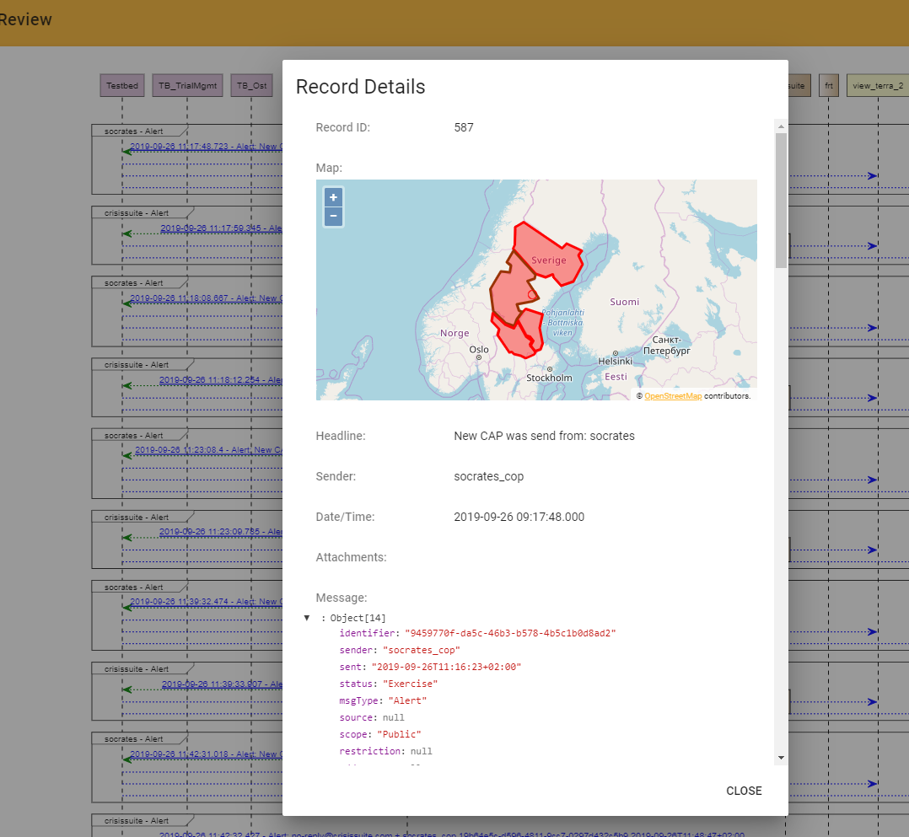

## Post process
When the trial is finished and all records are collected the MaAAR needs to do some actions to collect data and link records together
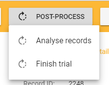

### Analyse records
This forces to let the MaAAR iterate through all reocrds and links specific records together e.g.: Alert and a Ack message received by another solution. This is needed to show the correct information in the sequence diagrams.

### Finish trial
Some messages will not contain the attachment because of its size, instead they will only have a URL where this can be downloaded.
For evaluation also those attachments are needed and as the MaAAR is not downloading them automatically this menu entry triggers the
download.

## Export data
To have the data (reocrds and attachments) also offline available it is possible to download them in 2 (sql and csv) formats. The data and
the attachments will be collected and zipped. This created zip file can be downloaded to the local client.
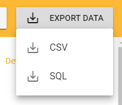

## List View
All records are diapled in chronilogical order (youngest at the top) in a list view. On click on an enntry the details of the record are
displayed in the details view. The list can be filtered my selecting one or more filter selection criterias.

### Filtering
The possible filter criterias are dispayed in the top row of the list view. DropDowns and Date/Time picker helps you defining your filter.
All criterias are combined as "AND". The Filter has also effect on the Timeline!

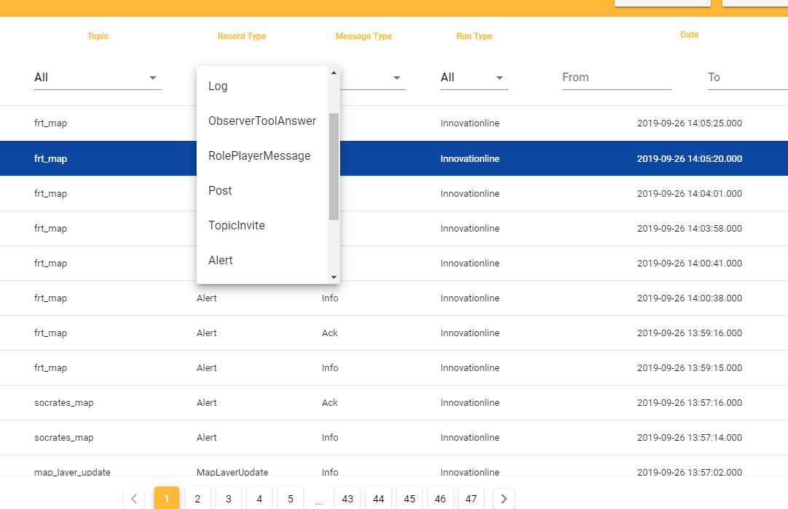

## Timeline
Additionaly to the list view, all records are displayed in the timeline. The timeline also shows the Trial (start/end), Scenario(s) (start/end) and session(s) (start/end). This information is received by the TrialManagementTool!

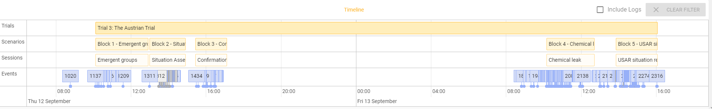

### Filtering
You can activate specific filters on the timeline by clicking either on the Tiral or on one of the scenario or on one of the block bar.

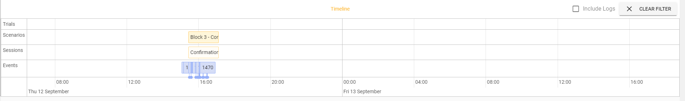

## Details View
Clicking in the list view on one entry, or clicking an item in the timeline displays the details of the record.

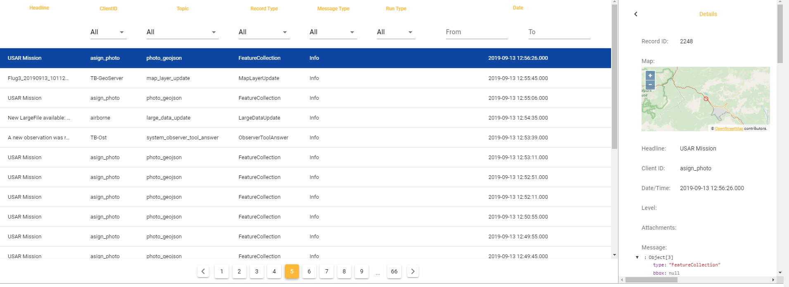

### Enlarge Details
In the details view in the top left corner the arrow is for enlarging the details panel to make the record data more readable. 

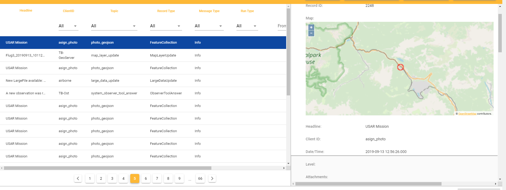

### Attachments
If in the records attachments are available, they will be displayed a link the details view. Clicking on one of the links opens
the attachment in a popup window. In this, the attachment can also be downloaded to the local client.

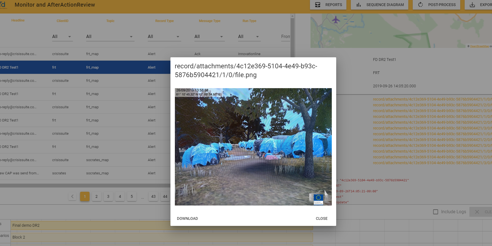

